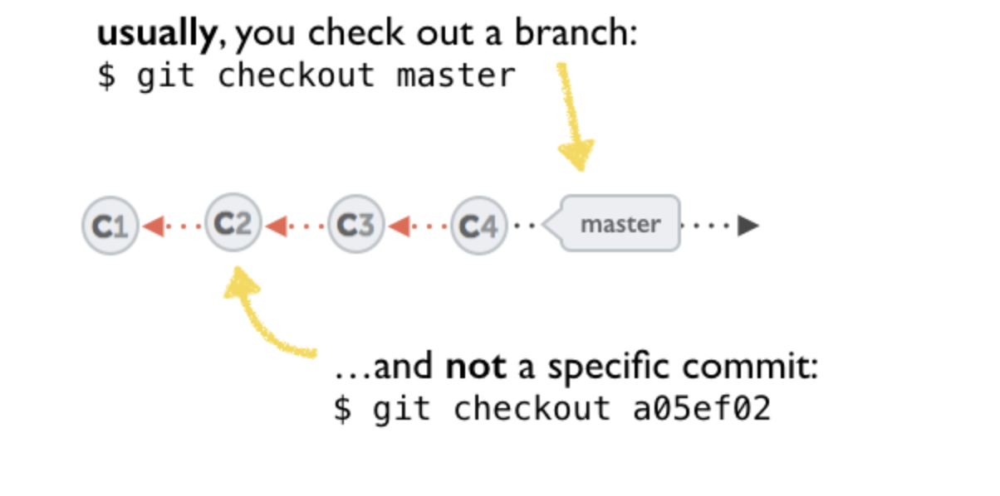

### Git Basic Commands

**Check status**

```shell
git status
```

**Add files**

```shell
git add fileOne.txt fileTwo.txt
```

```shell
git add .
```

**Unstage files**

```shell
git reset <file_name>
```

**Check commit history**

```shell
git log
```

```shell
git log --oneline
```

**Fetch remote changes**

```shell
git fetch <remote_name>
```

**Calculate diff**

```shell
git diff master origin/master
```

**Pull**

```shell
git pull <remote> <branch>
```

**Push**

```shell
git push <remote> <branch>
```

```shell
git push --force
```

**Create new branch**

```shell
git branch <branch_name>
```

**Checkout command**

1. switch branches

```shell
git checkout <branch_name>
```

2. Undo changes in a file

```shell
git checkout <file_name>
```

3. Moving to a commit or tag

```shell
git checkout <commit_hash>
```

_When you checkout to a commit, you are in detached head state which means the changes do NOT belong to any branch._



**Stash**

Pushing files to stash

```shell
git stash push
```

Pushing all the files including untracked files to stash

```shell
git stash push -u -k
```

Applying stash

```shell
git stash pop
```

[Aliases](aliases.md)
