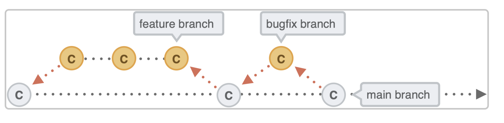

# Branches in Git

Branches are a powerful feature in Git that allow you to develop features, fix bugs, and experiment with new ideas in isolation from the main codebase. This document covers the fundamentals of branching, best practices, and strategies.

## What is a Branch?

- When creating commits, each commit is linked to its parent commit. This forms a chain of commits.
- Branches enable you to incorporate new features without breaking the original code.
- A branch represents an independent line of development, consisting of a series of commits. You can create a branch from any other branch or from any commit.


## Listing All Branches

To view all branches in your repository, use:

```shell
git branch
```

## Creating Branches

You can create a new branch using one of the following commands:

```shell
git branch <branch-name>
```

or create and switch to a new branch in one command:

```shell
git checkout -b <branch-name>
```

## Deleting Branches

To delete a branch that is no longer needed:

```shell
git branch -D <branch_name>
```

## Mainline Development

The mainline development strategy emphasizes integrating your changes with those of your teammates. All contributors work on the mainline branch.


### Pros and Cons

**Pros:**
- Easy to track changes due to a single branch.

**Cons:**
- Risk of shipping large changes.
- Less resilient to bugs.
- Requires a high-quality testing environment and QA standards.

## Working with Multiple Branches

Common branch types include:

- **Feature Branch**: For developing new features.
- **Develop Branch**: Integrates features before merging to main.
- **Hotfix Branch**: For urgent fixes.
- **Release Branch**: Prepares for production releases.
- **Main Branch**: Stable production-ready code.


## Branching Strategies

### Git Flow (Overview)

- **Two long-running branches**: `main` and `develop`.
- **Feature branches** are created from `develop` and merged back into it.
- A **Release branch** is created from `develop` for final testing and bug fixes.
- Finally, merge the Release branch back to `main` and tag the release.


### GitHub Flow



1. Only one long-running branch (`main`).
2. Create feature or bugfix branches from `main`.
3. Merge feature branches back into `main` after completion.

## Branch Naming Conventions

- Use lowercase letters for branch names: `feature/new-login`.
- Separate words with hyphens(-).
- Use alphanumeric characters (0-9, a-z).
- Choose descriptive names, possibly including a JIRA ID: `feature/T-456-user-auth`.

### Branch Prefixes

- **Feature Branch**: 
  ```
  feature/T-456-user-authentication
  ```

- **Bugfix Branch**: 
  ```
  bugfix/T-789-fix-header-styling
  ```

- **Release Branch**: 
  ```
  release/v2.0.1
  ```

- **Hotfix Branch**: 
  ```
  hotfix/T-321-security-patch
  ```

- **Docs Branch**: 
  ```
  docs/T-654-update-readme
  ```

---

## Moving a Commit to Another Branch

To move a commit from one branch to another:

1. Use `git log` to copy the commit hash of the commit you want to move.
2. Switch to the target branch:

```shell
git checkout <branch_name>
git cherry-pick <commit_hash>
```

---

## Understanding HEAD

- The term **HEAD** refers to the pointer that indicates the current branch's latest commit i.e., top-most commit.
- When you run `git log`, you might see output like:

  ```
  commit 03as…e2 (HEAD -> main)
  ```

- You can use HEAD in various commands, such as resetting to a specific commit or referencing commits in other operations.

## Additional Resources

For more practice with branching, refer to the [Branch Exercise](../exercises/branchExercise.md).
