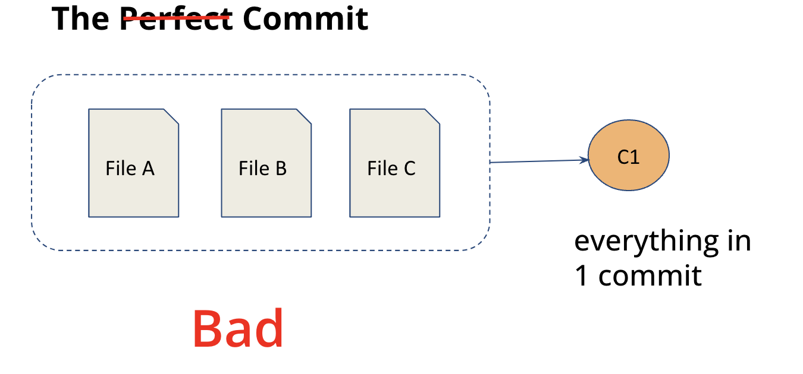
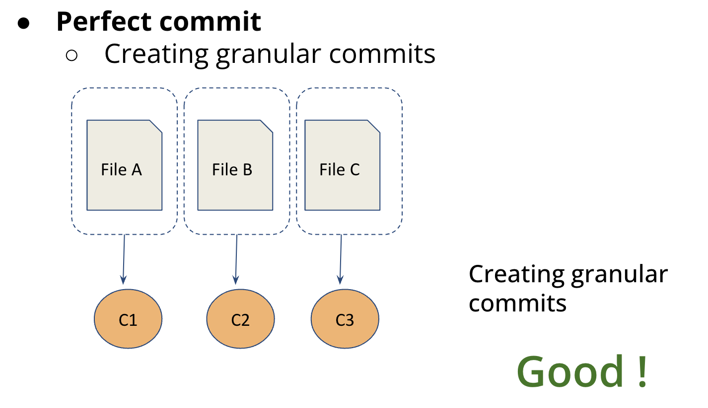

## Commits

A **commit** is a snapshot of your project taken by Git. Each snapshot is stored in the local Git repository, allowing you to track changes over time.


### How to Create Perfect Commits

1. **Create Granular Commits**

   Ensure that each commit focuses on a single task or feature. This makes it easier to understand the history and revert changes if necessary.

   

   

2. **Write Valuable Commit Messages**

   - **Subject Line**: A brief and concise summary of the changes.
   - **Message Body**: A detailed explanation of the changes, including important facts, written as concisely as possible.
   - **Follow Conventional Commits**: Adhere to a standardized format for clarity.

---

### Writing Commit Messages Properly

The **Conventional Commits** specification provides a structured way to write commit messages:

```
<type>[optional scope]: <description>

[optional body]

[optional footer(s)]
```

#### Types with Examples

1. **feat**: A new feature
2. **fix**: A bug fix
3. **Other types**: 
   - `build`: Changes that affect the build system or external dependencies
   - `chore`: Routine tasks that do not modify source or test files
   - `refactor`: Code changes that neither fix a bug nor add a feature
   - `test`: Adding missing tests or correcting existing tests
   - `style`: Changes that do not affect the meaning of the code (white-space, formatting, etc.)
   - `docs`: Documentation-only changes
4. **BREAKING CHANGE**: Use `!` to highlight breaking changes

#### Examples

- `fix: Resolve issue with user registration`
- `feat: Add user authentication feature`
- `refactor: Extract validation helper function`
- `chore: Clean up unused dependencies`

#### Commit Messages with Scope

You can specify a scope for more context:

```
feat(lang): add Telugu language
feat(user login): add user login form
```

*Use `!` to draw attention to a breaking change:*

```
feat!: allow provided config object to extend other configs

BREAKING CHANGE: The `extends` key in the config file is now used for extending other config files.
```

#### Commit Message with Body and Footer

Including a body and footer can provide additional context:

```
feat: Implement user authentication

Add a new feature to allow users to authenticate using email and password.

- Add login form component
- Implement authentication API endpoints
- Store user authentication tokens in local storage

Closes #123

Co-authored-by: Penchal Naidu Modhepalli <PenchalNaiduModhepalli@example.com>
```

**Note**: Always use the present tense when drafting commit messages. For example, use **Implement user authentication** instead of **Implemented user authentication**.

Further reading: [Conventional Commits](https://www.conventionalcommits.org/en/v1.0.0/)

### Amending Commits

To modify the most recent commit message or content, you can use the following commands:

```shell
git commit -m "<commit_message>"  # Create a new commit
git commit --amend -m "<new_message>"  # Amend the last commit with a new message
git commit --amend --no-edit  # Amend the last commit without changing the message
```

---

### Additional Resources

- [Commits Exercise](../exercises/commitsExercise.md)
