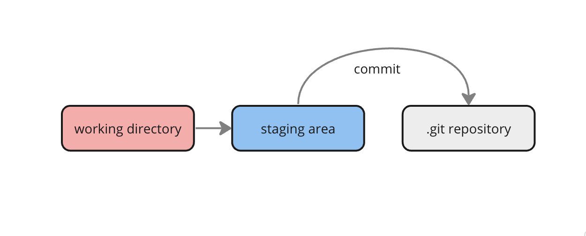

## Commits

Commit is the snapshot of the project taken by git. Snapshots are always committed to the local git repo



```shell
git commit -m <commit_message>

git commit --amend -m <new_message>

git commit --amend --no-edit
```

---

### Undoing commits

```shell
git revert <commit_sha>

git reset <commit_sha> / HEAD~(number of commits back)

git reset --hard <commit_sha>
```

---

### Writing commit messages properly

The **Conventional Commits** specification provides an easy set of rules for writing commit messages properly.

```
<type>[optional scope]: <description>

[optional body]

[optional footer(s)]
```

**Types with Examples**

1. fix: - for bug fixes
2. feat - for new features
3. BREAKING CHANGE (use ! to draw attention)
4. Other types ( build:, chore:, refactor:, test:, style: , docs:)

**Examples**

```
fix: Resolve issue with user registration
```

```
feat: Add user authentication feature
```

```
refactor: Extract validation helper function
```

```
chore: Clean up unused dependencies
```

**Commit messages with scope**

```
feat(lang): add Polish language
```

_Use ! to draw attention to a commit_

```
feat!: allow provided config object to extend other configs

BREAKING CHANGE: `extends` key in config file is now used for extending other config files
```

**Commit message with body and footer**

```
feat: Implement user authentication

Add a new feature to allow users to authenticate using email and password.

- Add login form component
- Implement authentication API endpoints
- Store user authentication tokens in local storage

Closes #123

Co-authored-by: Aashima Ahuja <aashi@example.com>
```

**Note**: Use present tense while drafting commit messages like it should be **Implement user authentication** and not **Implemented user authentication**

Further reads

https://www.conventionalcommits.org/en/v1.0.0/

[Commits exercise](../exercises/commitsExercise.md)
