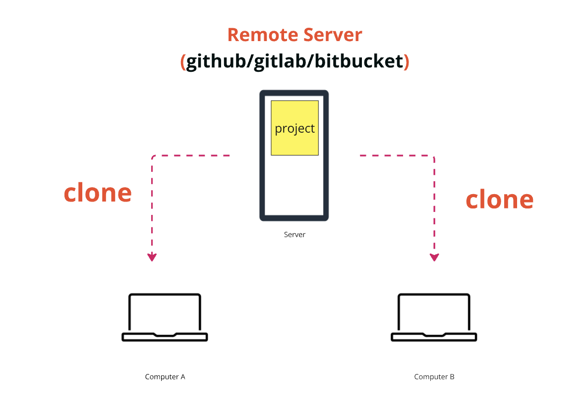
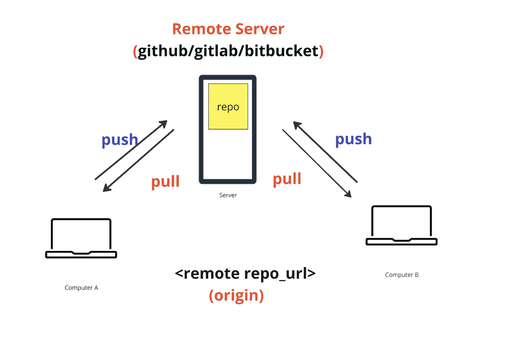
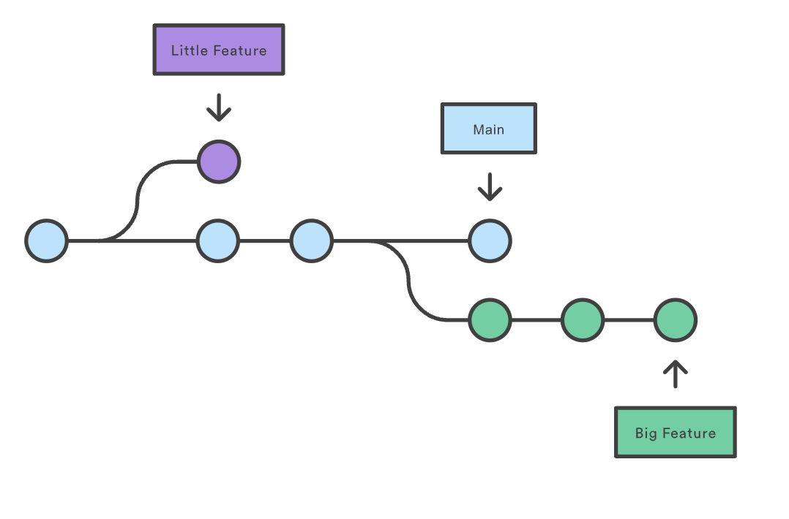

## Git

Git is the most popular open-source version control system (VCS) that tracks changes within files and facilitates collaboration among developers. Its distributed nature enhances reliability and allows multiple users to work on a project simultaneously.

---

## Git Terminologies

Understanding key Git terminologies is essential for effective use of the system. Here are some fundamental concepts:

1. **Repository**
2. **Remote**
3. **Origin**
4. **Clone, Push, Pull**
5. **Commits**
6. **Branches**

### Repository

- When you set up Git in your project, it creates a `.git` folder inside the project directory. This folder is responsible for all versioning and file tracking.
- A project that contains a `.git` folder is referred to as a **repository**.

### Remote, Origin, Clone, Push, Pull

- **Remote**: A remote repository is a version of your project that is hosted on the internet or another network. It allows collaboration by enabling multiple users to access the same project.
- **Origin**: This is the default name given to the remote repository from which you clone your local repository. It serves as the primary reference point for your remote interactions.
- **Clone**: Cloning a repository creates a local copy of the remote repository on your machine.
- **Push**: This command uploads your local changes to the remote repository, making them available to others.
- **Pull**: This command fetches and integrates changes from the remote repository into your local repository.

### Commits

A **commit** is a snapshot of your project at a specific point in time. Each commit records changes made to the files in the repository and includes metadata such as the author, date, and a message describing the changes. Snapshots are always committed to the local Git repository.

### Branches

A **branch** is a separate line of development in a Git repository. It allows you to work on different features or fixes without affecting the main codebase. Each branch consists of a chain of commits.

---

### Additional Resources

- [Git Workflow](git-workflow.md)
