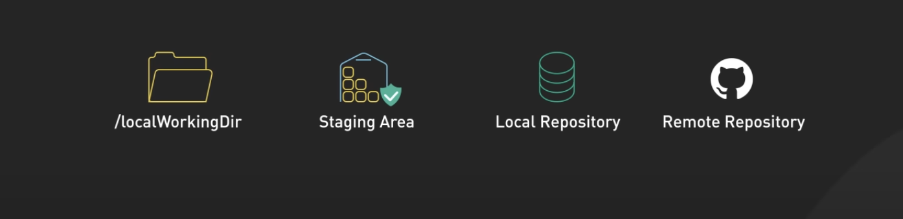
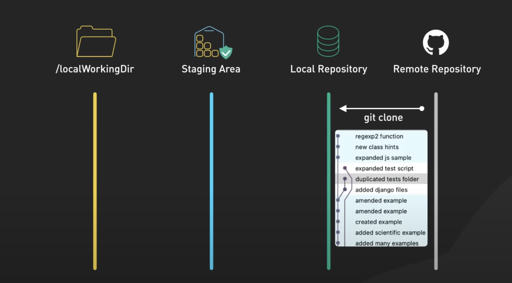
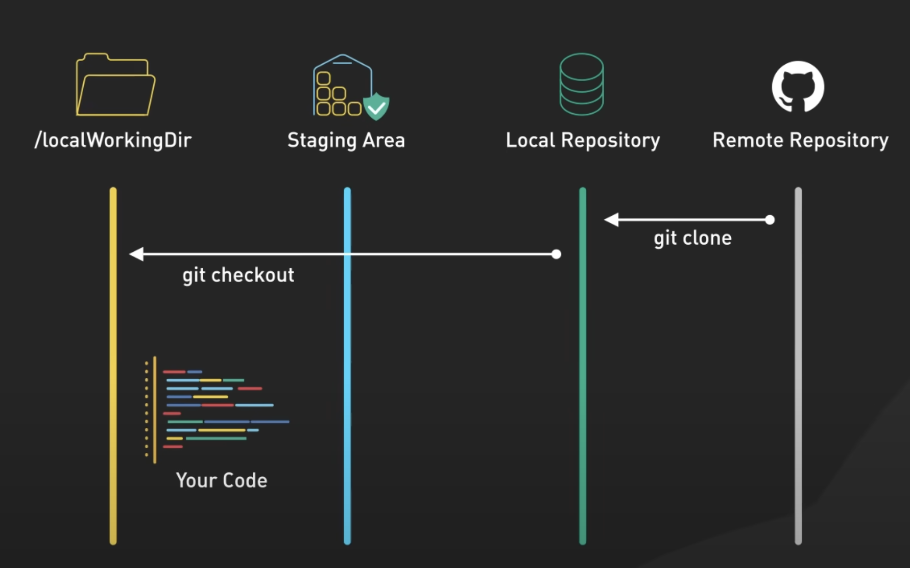
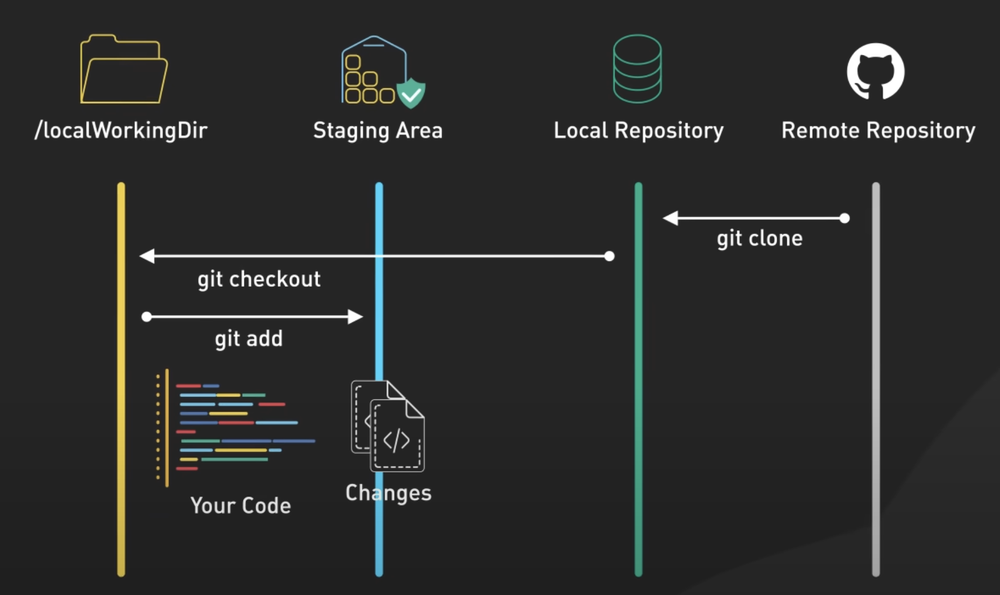
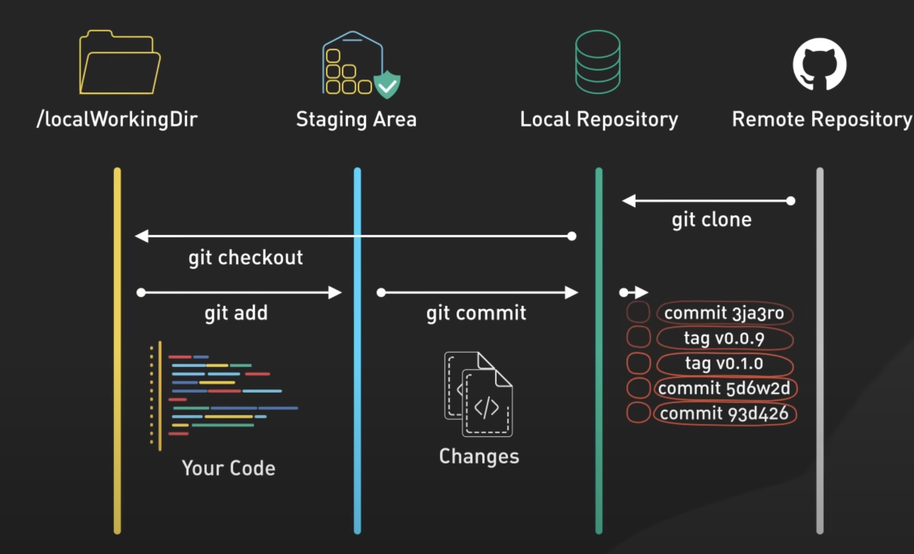
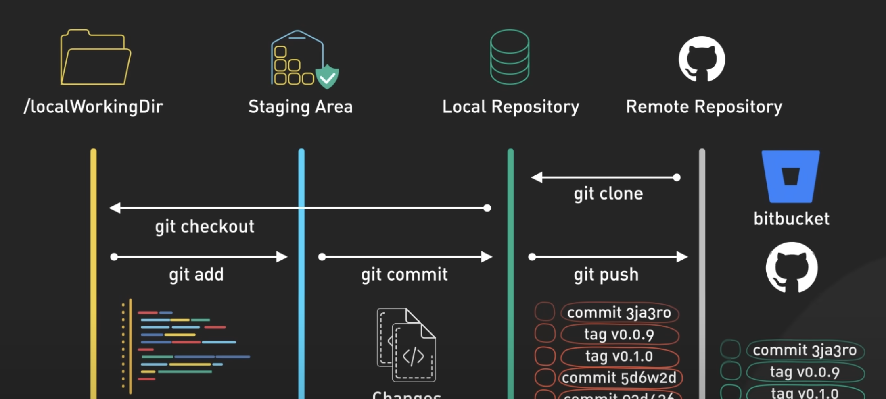
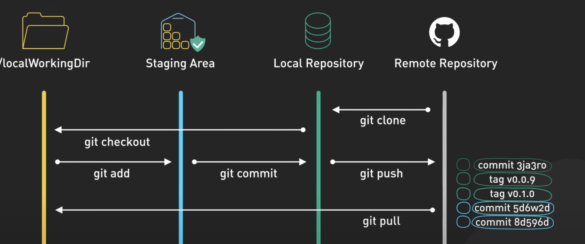
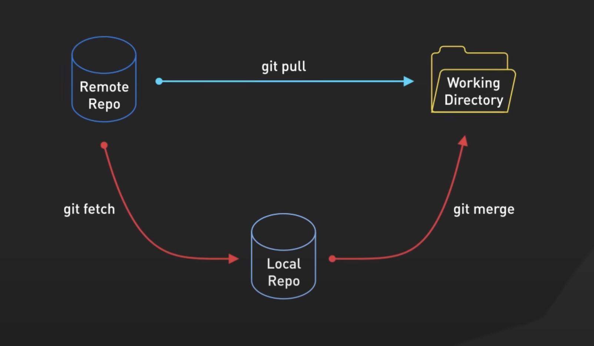

### Git workflow

There are 4 areas where your code lives while working in git

**Step 1**: Clone your project from Remote repository

**Step 2**: Start working on a file ( you are in working directory)
Working directory is your local dev environment where you make changes to your code

**Step 3**: Adding your changes to Staging area.
Staging area is a place for your finalised changes.

**Step 4**: Committing your changes to your local repository.
Git commit takes snapshot of the staging area and saves it local Repository.
This creates a permanent record of the changes which you can refer back to

**Step 5**: Pushing your changes to remote repository.

### Integrating your teammate's work

**Git pull**

[Git setup](setup.md)
