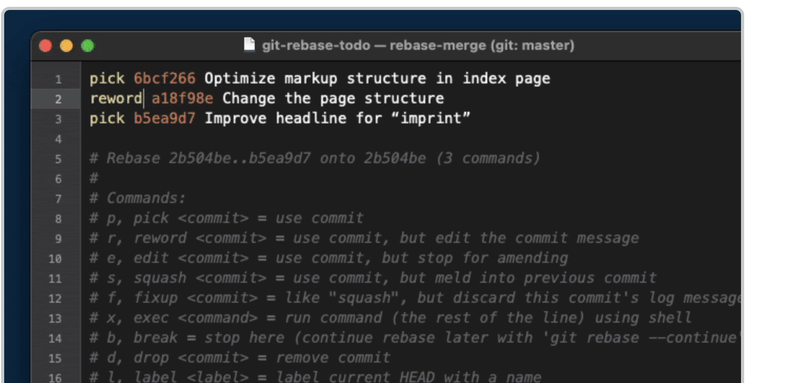

# Powers of Interactive Rebase

Interactive rebase is a powerful Git feature that allows you to rewrite commit history. With interactive rebase, you can:

- Change commit messages
- Combine multiple commits
- Split and edit existing commits
- Reorder commits
- Delete commits

## Change a Commit Message

### Using `--amend`

To change the message of the most recent commit, use:

```shell
git commit --amend
```

> **Note:** The `--amend` option only allows you to modify the last commit.

### Using Interactive Rebase

To change a commit message further back in history, you can use interactive rebase:

```shell
git rebase -i HEAD~3
```

In the editor that opens, replace `pick` with `reword` (or `r`) next to the commit whose message you want to change.



## Combine Two Commits

To combine multiple commits into one, initiate an interactive rebase:

```shell
git rebase -i HEAD~3
```

In the editor, change `pick` to `squash` (or `s`) for the commit you want to combine with the previous commit.


## Delete a Commit

To delete a specific commit, start an interactive rebase:

```shell
git rebase -i HEAD~3
```

In the editor, simply remove the line corresponding to the commit you want to delete or change `pick` to `drop`.


## Additional Resources

For practical experience, check out the [Interactive Rebase Exercise](../exercises/interactiveRebaseExercise.md).
