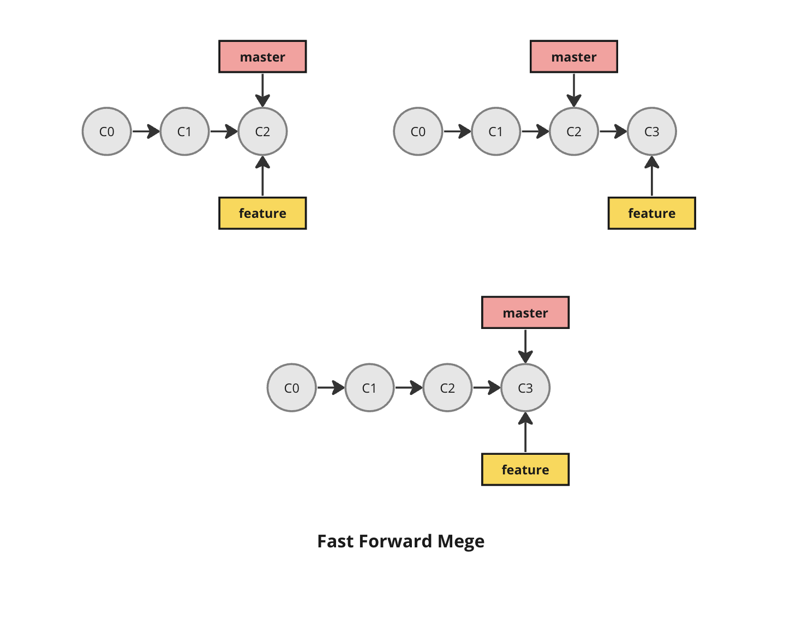
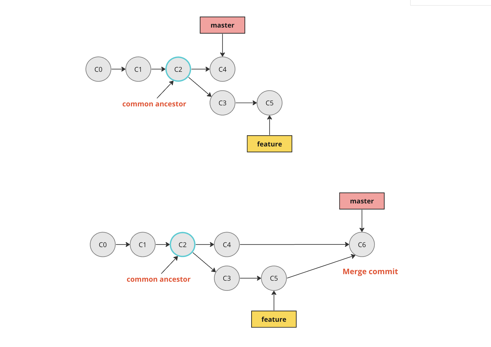

**Merging**

For merging your feature branch into master
you can do

```shell
git checkout master
git merge feature-branch
```

_Note: We never ususally merge directly to master.The better way is to create a pull request, and merge it through github/gitlab/bitbucket_

Incase your pull request shows conflicts, you can either resolve it through github or resolve it locally by merging master in your branch and resolving conflicts

```shell
git checkout master
git pull

git checkout feature-branch
git merge master
```

**Fast forward merge**



**Three way merge**



To make an integration, Git has to create a new commit that contains all the changes and take care of the differences between the branches — this is what we call a merge commit.

[Squashing commits](squashing.md)
