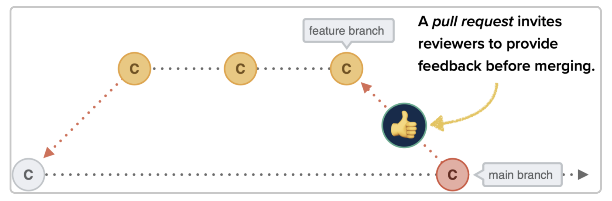

#### What are Pull Requests

Pull requests are not a feature of git but is provided by git hosting platforms like Github, Gitlab, Bitbucket

#### Why create PRs ?

**Collaboration and Code reviews**

With pull requests you can invite other people to review your work and give you feedback. 

Once your changes have been approved, your branch can be merged to master