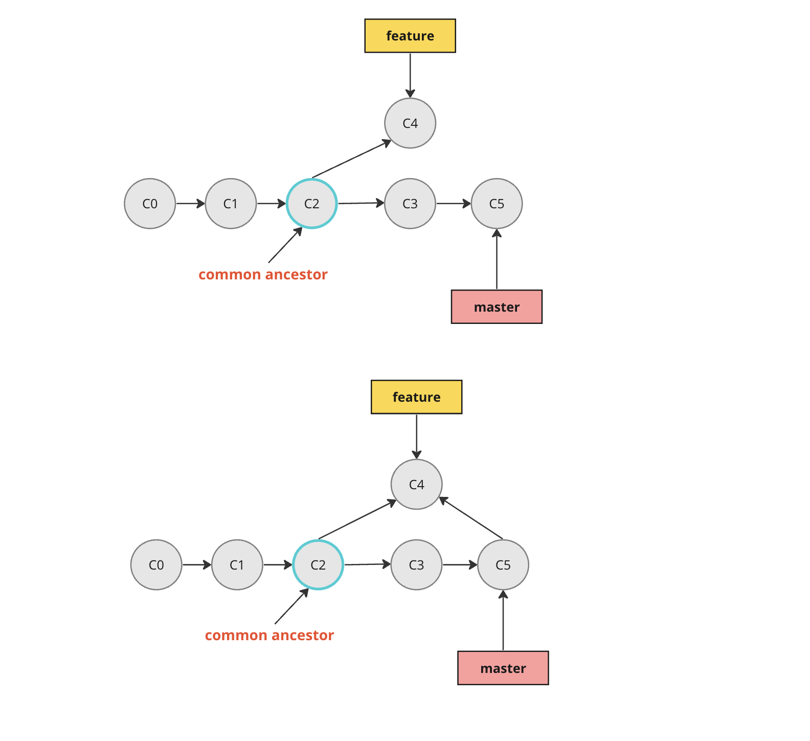
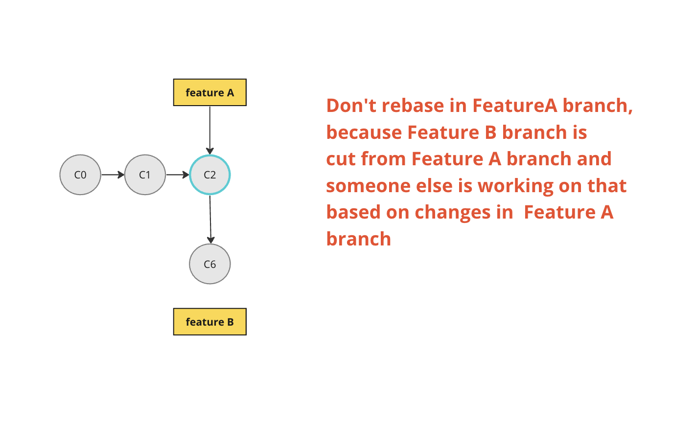

## Rebase

With the rebase command, you can take all the changes that were committed master and replay them on your feature.

For this example, you would check out the feature branch, and then rebase it onto the master

```shell
 git checkout featureA
 git rebase master
```



- With rebase, there is no merge commit so history is clean

**Pitfall**

Do not rebase commits that exist outside your repository and that people may have based work on.



[Merge and Rebase Exercise](../exercises/mergingExercise.md)
