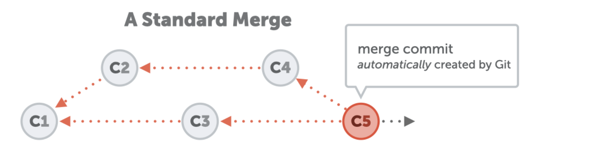
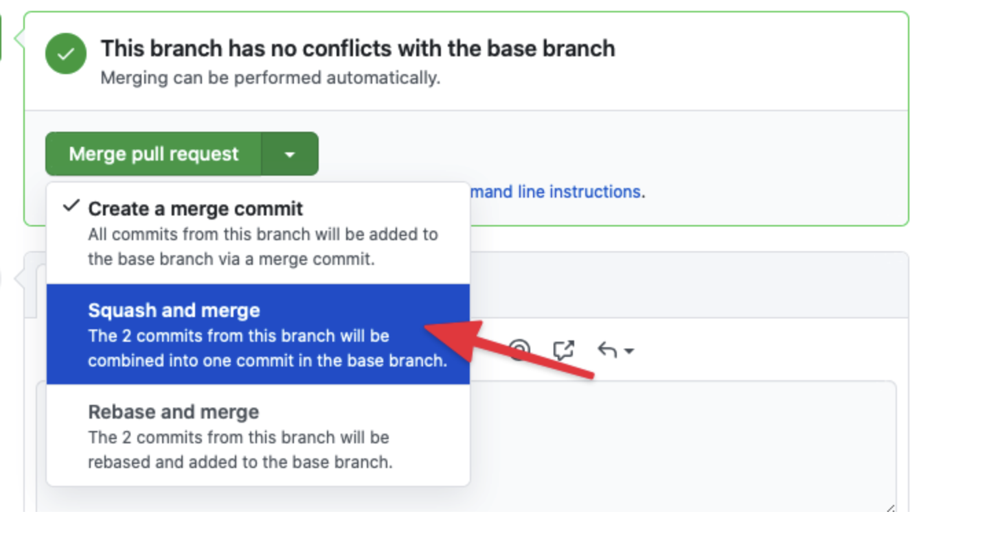

# Squashing Commits in Git

To "squash" in Git means to combine multiple commits into a single commit. This practice can help maintain a clean and concise commit history.

## When to Squash?

Deciding when to squash commits depends on your team's workflow and preferences. Here are some common scenarios:

- **Clean Commit History**: Instead of having many individual commits that may be unnecessary, squashing allows only a single commit to appear in the main commit history.
- **Logical Grouping**: Squashing can help group related changes together, making it easier to understand the purpose of a commit.

## How to Squash Commits

### Using Interactive Rebase

To squash the last three commits, use the following command:

```shell
git rebase -i HEAD~3
```

This will open an editor where you can choose which commits to squash. Change the word `pick` to `squash` (or `s`) for the commits you want to combine.


### Using Merge with Squash

You can also squash commits when merging branches. For example, to squash commits from a feature branch:

```shell
git merge --squash feature/authentication
```

This command combines all the changes from the `feature/authentication` branch into your current branch as a single commit.

### Merging without Squash

When you merge without squashing, Git automatically creates a new merge commit that includes all changes:



### Merging with Squash

When you merge with squash, you must create a manual commit. Git does not automatically add one:


## Pull Requests and Squashing

Many Git hosting platforms, such as GitHub, GitLab, and Bitbucket, provide an option to squash commits when merging a pull request (PR). This feature can help maintain a clean commit history in the main branch.



## Additional Resources

For more detailed guidance on using interactive rebase, refer to the [Interactive Rebase Documentation](interactive-rebase.md).
