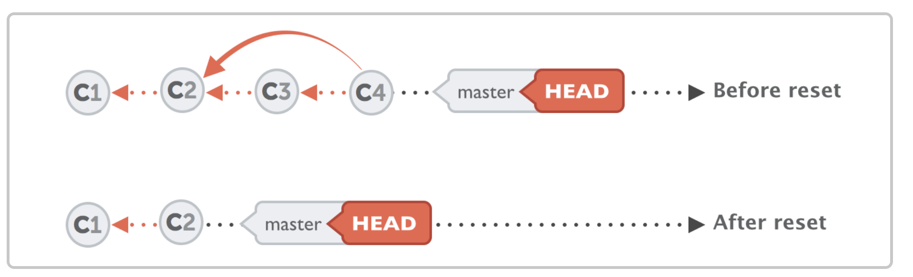

## Undo Mistakes in Git

This document provides a collection of common scenarios for undoing mistakes in Git, along with the corresponding commands to resolve them.

<div style="display:flex; flex-direction:column; gap:16px">

<details>
<summary><strong>Discard Uncommitted Changes in a File</strong></summary>
  
To discard changes in a specific file:

```shell
git restore <filename>
```
</details>

<details>
<summary><strong>Restore a Deleted File</strong></summary>
  
If you've accidentally deleted a file, you can restore it with:

```shell
git restore <filename>
```
</details>

<details>
<summary><strong>Fix a Typo in Your Commit Message</strong></summary>
  
To amend the last commit message:

```shell
git commit --amend -m "<new_message>"
```

**Note:** Amending commits changes the commit hash, creating a new commit. Avoid amending if you have already pushed to the remote.
</details>

<details>
<summary><strong>Include a Forgotten File in the Last Commit</strong></summary>

If you forgot to include a file in your last commit:

```shell
git add <forgotten_filename>
git commit --amend --no-edit
```
</details>

<details>
<summary><strong>Discard All Changes and Revert to the Previous State</strong></summary>

If you want to discard all changes and return to the last committed state:

```shell
git reset --hard HEAD
```
</details>

<details>
<summary><strong>Remove Recent Commits</strong></summary>

To remove recent commits from your branch:



```shell
git reset --hard <commit_hash>
```
</details>

<details>
<summary><strong>Move a Commit from Main to a Feature Branch</strong></summary>

If you accidentally committed to the main branch instead of a feature branch:

**Move the commit to the feature branch:**

```shell
git checkout <feature_branch>
git cherry-pick <commit_hash>
```

**Remove the commit from the main branch:**

```shell
git reset --hard HEAD~1
```
</details>

<details>
<summary><strong>Recover a Lost Commit After a Hard Reset</strong></summary>

If you've lost a commit after a hard reset and want to recover it:

```shell
git reflog
```

Find the hash of the commit before the reset and run either:

```shell
git reset --hard <hash>
```

or

```shell
git branch <branch_name> <hash>
```
</details>

<details>
<summary><strong>Recover a Deleted Feature Branch</strong></summary>

If you've accidentally deleted a feature branch and need to restore it:

```shell
git reflog
```

Find the commit associated with the feature branch and run:

```shell
git branch <branch_name> <hash>
```
</details>

</div>

### Additional Resources

- [Reflog Exercise](../exercises/reflogExercise.md)
