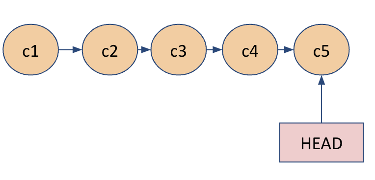
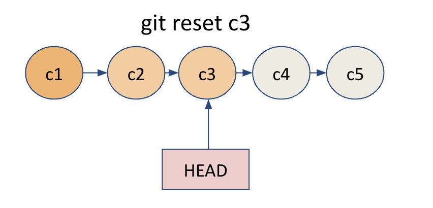
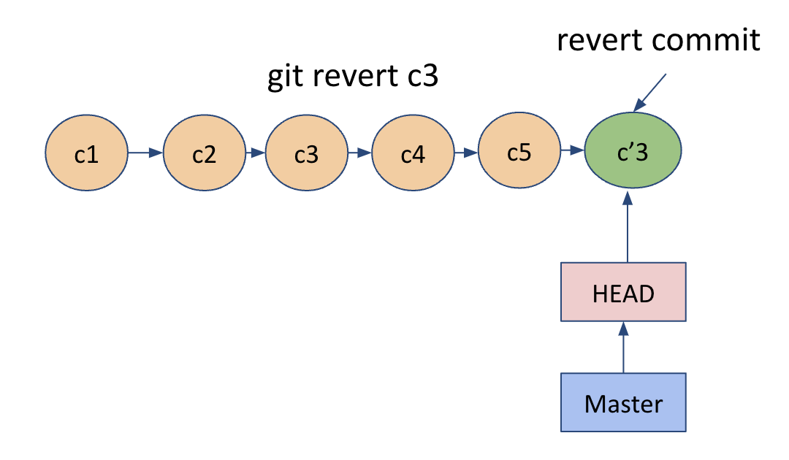

## Undo changes in git

### 1. Undo changes in a file

```shell
git checkout <file_name>

git restore file_name
```

### 2. Unstage staged changes

```shell
git restore –staged filename

git reset <file_name>

git reset .

```

### 3. Undo commits

#### Using git reset

- Git reset allows you to remove the commits, or say reset a branch to a specific commit
- There are types of reset -
  - Hard reset
    - Remove commits and don’t keep changes
    - git reset <commit_hash> --hard
- Soft reset
  - Remove commits but keep changes in the files
  - git reset <commit_hash>




```
Issue with reset:
You can loose shared history if you reset the commits and someone else has already based his/her work on those commits.
```

#### Using git revert

- Git revert command also undoes the commits but it creates an additional commit undoing that change.
- git revert doesn’t change the project history which makes it safe for the commits which are already published on shared repository

  

```
git revert is a safer option to undo a commit especially if the commit has already been pushed to remote
```

[Branches](../docs/branches.md)
