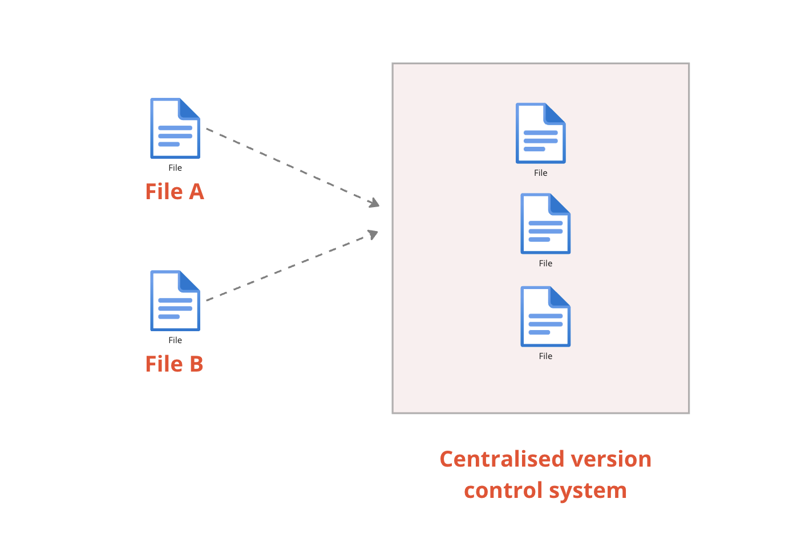
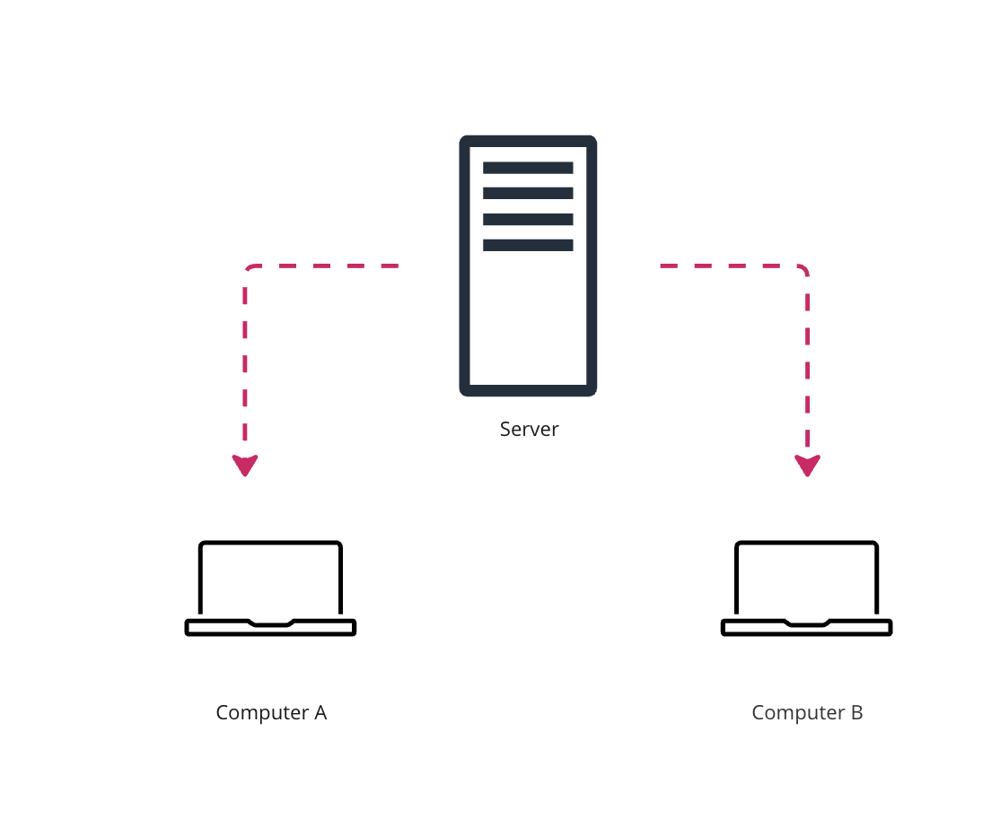
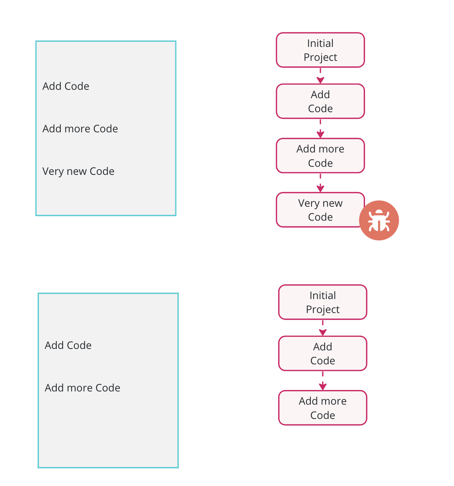
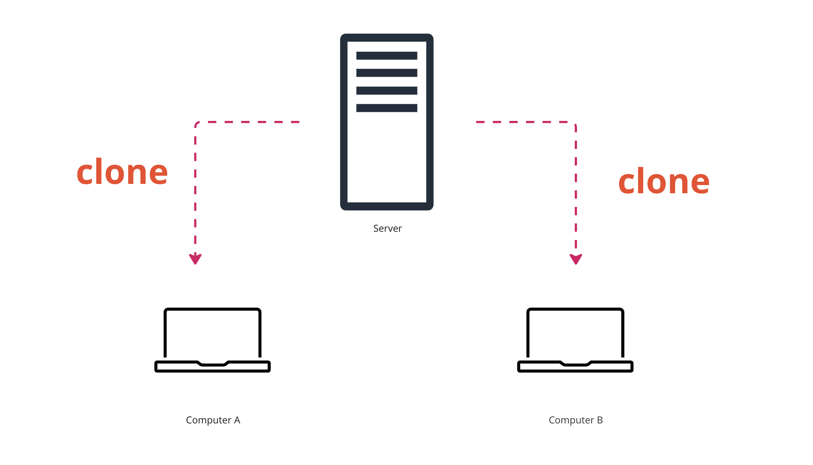
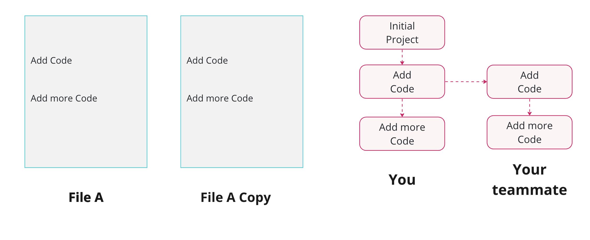
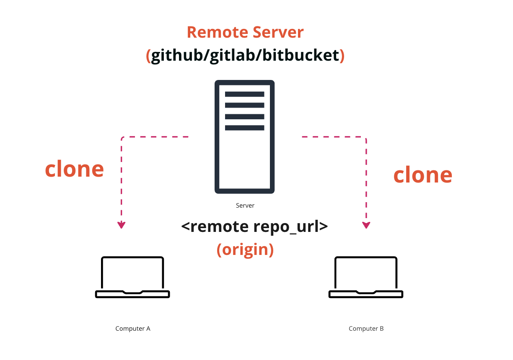
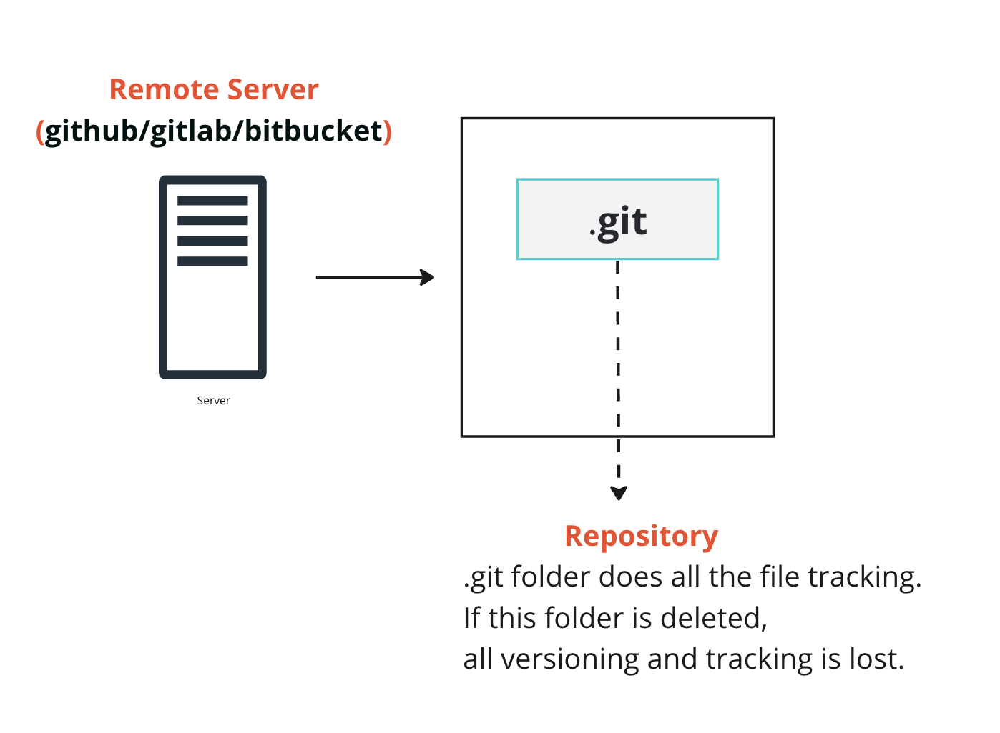
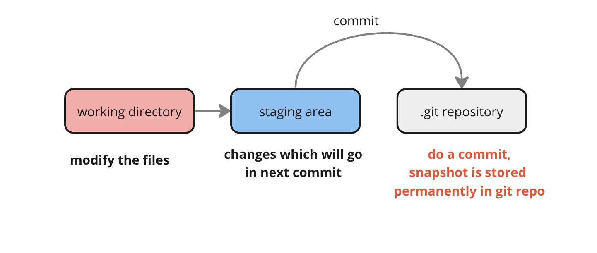

#### Version Control

Version control , also called as source control is the practice of tracking and managing changes to software code.

**Problem : Maintaining separate files**

We have to maintain separate files which is not scalable. We want a system which could do version control within a single file.

_Git_Course.docx
Git_Course_v1.docx
Git_Course_v2.docx
Git_Course_final.docx_

**Problem: Collaboration**

**Problem: Reliability**

Distributed Server to avoid single point of failure

**Git**

Tracks history of changes in files

---

---

**Git Workflow**

[Git setup](setup.md)
