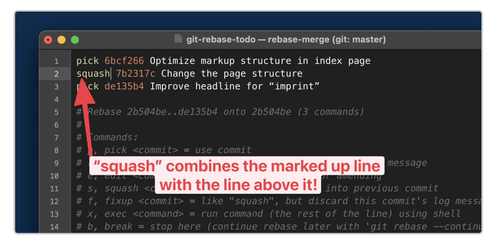
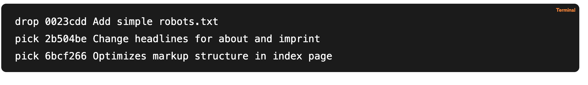

### Powers of Interactive Rebase

*Interactive rebase allows you to rewrite the commit history. You can*

- change commit messages
- combine multiple commits
- split and edit existing commits
- reorder commits
- delete commits


#### Change a commit message

***Using ammend***

```
git commit --amend
```

*With amend you can only amend last commit*

***Using Interactive rebase***

```
git rebase -i HEAD~3
```

use reword to change the commit message


#### Combine two commits

```
git rebase -i HEAD~3
```



#### Delete a commit

```
git rebase -i HEAD~3
```
